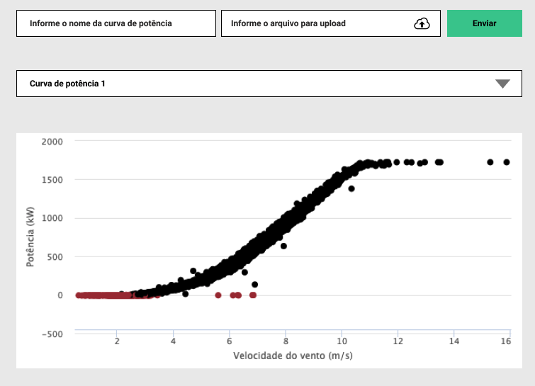

## Tarefa 1: Criar uma aplicação Web para gerar um gráfico de curva de potência.


```
Curva de potência é um gráfico que indica qual será a potência elétrica disponível
no aerogerador para diferentes velocidades de vento.
```

A aplicação web deve possuir um campo para upload do arquivo .csv da curva de potência. Deve ser possível dar um nome a curva que está sendo importada e
realizar o cadastro no backend.
Após cadastro, as curvas devem ficar disponíveis em um select. Ao selecionar uma curva, o gráfico com os pontos deve ser plotado.

**Arquivos que devem ser utilizado para importação:**

- [Arquivo 1](arquivos-importacao/Abr-2017-curva-potencia-windbox.csv)
- [Arquivo 2](arquivos-importacao/Mai-2017-curva-potencia-windbox.csv)
- [Arquivo 3](arquivos-importacao/Nov-2017-curva-potencia-windbox.csv)


**Exemplo da tela (baixa fidelidade):**


**Dica:** O gráfico utilizado para plotar o gráfico de curva de potência é do tipo scatter: [Highchart scatter](https://www.highcharts.com/demo/scatter)

```
A aplicação deve ser desenvolvida em Django e o banco de dados utilizado deve ser
o Postgresql. Ao final, deve ser publicada no Heroku (conta gratuita).
```

# Tarefa 2: Algoritmo


Na mesma aplicação criada na tarefa anterior, deve ser criada uma tela que deve
possibilitar a execução de um algoritmo. A tela deve conter:
```
● Input 1 para entrada de número inteiros e um botão para adicionar o
número a uma lista.
● Listagem dos números adicionados.
● Input 2 para entrada de número inteiro e um botão para executar o
algoritmo.
● Um campo para saída do resultado.
O algoritmo: Dado um número no input 2, deve ser verificado se existem dois
números na listagem que somados são iguais ao número informado no input 2.
A saída do algoritmo deve ser os dois números encontrados. Caso não seja
encontrado os dois números, deve ser mostrado uma mensagem informando.
```
Obs.: Fazer as devidas validações.

**1. Organização do código e boas práticas de programação são diferenciais.**

**2. Após entregue, a LogAp pode solicitar que o código seja apresentado e
explicado.**


